# D01_Linux

## Part 1. Установка ОС
- 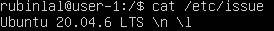  
Узнали версию Ubuntu, выполнив команду `cat /etc/issue`.

 

## Part 2. Создание пользователя

- 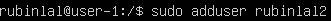  
Использовали команду adduser для создания нового пользователя `rubinlal2`.

 

- 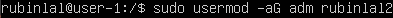  
Добавили пользователя в группу командой `sudo usermod -aG adm newusername`.

 

- 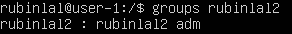  
Проверили, что пользователь добавлен в нужную группу.

 

- 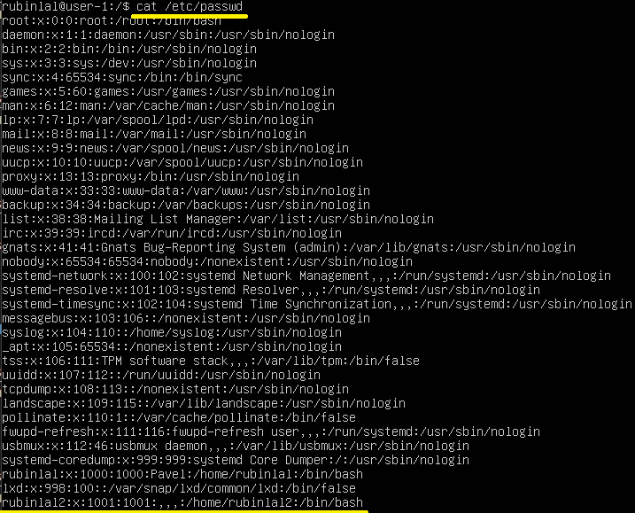  
Убеждаемся, что новый пользователь есть в выводе команды
`cat /etc/passwd`.

 

## Part 3. Настройка сети ОС

- 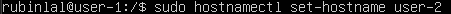  
Задали название машины вида `user-2`.

 

- 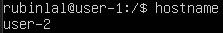  
Проверили, что название машины изменилось.

 

- 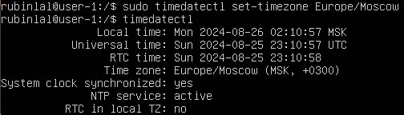  
Установили текущую временную зону командой `sudo timedatectl set-timezone Europe/Moscow` и проверили ее.

 

- 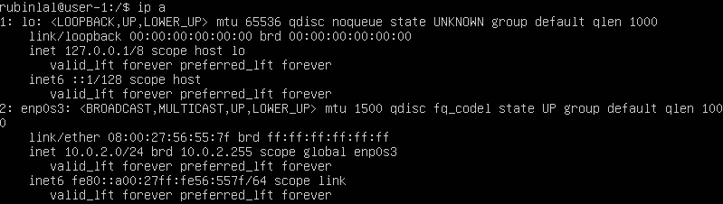  
Вывели названия сетевых интерфейсов командой `ip a`.

- lo - используется для отладки сетевых программ и запуска серверных приложений на локальной машине.

 

- 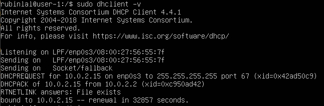  
Получили ip адрес устройства, на котором работаем, от DHCP сервера. Команда `sudo dhclient -v`. 

- DHCP - Dynamic Host Configuration Protocol (Протокол динамической конфигурации узла) - сетевой протокол, используемый для автоматической конфигурации устройств, подключенных к сети, включая назначение IP-адресов, сетевых масок, шлюзов и других параметров.

 

- 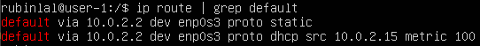  
Определили внутренний IP-адрес шлюза (gw/gateway).

 

- 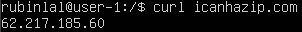  
Определили внешний ip-адрес шлюза (ip).

 

- 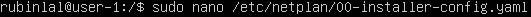  
Открываем файл конфигурации Netplan для редактирования.

 

- 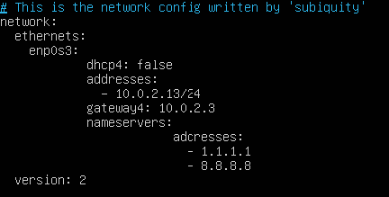  
1. Установили значение dhcp4 на false - отключили протокол DHCP (чтобы указать статический ip адрес интерфейса).
2. В addresses установили статический ip адрес сервера.
3. В gateway4 указываем шлюз.
4. В nameservers указали DNS (ip адреса серверов имен). DNS Google - имеет адрес 8.8.8.8.

 

-   
Применили конфигурацию Netplan.

 

- 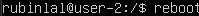  
Перезагрузили систему.

 

- 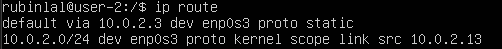  
Выводим на экран внутренний IP-адрес шлюза командой `ip route`.

 

- 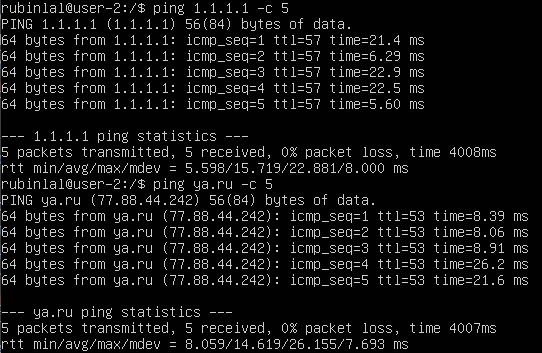
Пингуем удаленные хосты 1.1.1.1 и ya.ru.

 

## Part 4. Обновление ОС

- 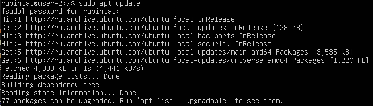
Проверка актуальности системных пакетов.

 

- 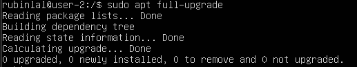
Обновление системных пакетов командой `sudo apt full-upgrade`.

 

## Part 5. Использование команды sudo

- 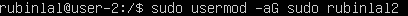  
Разрешили пользователю созданному в part 2 выполнять команду `sudo` - расшифровывается как "superuser do". Позволяет пользователю выполнять команды с привилегиями суперпользователя, что дает доступ к выполнению административных задач и команд, которые обычный пользователь не может выполнить.

 

- 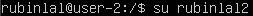  
Сменили текущего пользователя командой `su`.

 

- 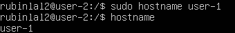  
Поменяли hostname os от имени rubinlal2.

## Part 6. Установка и настройка службы времени

- 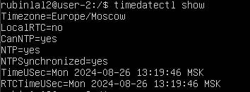  
Проверили, что время синхронизируется автоматически командой `timedatectl show`.

## Part 7. Установка и использование текстовых редакторов

### VIM

- 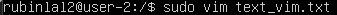  
Создаем текстовый файл и открываем его в vim.

 

- 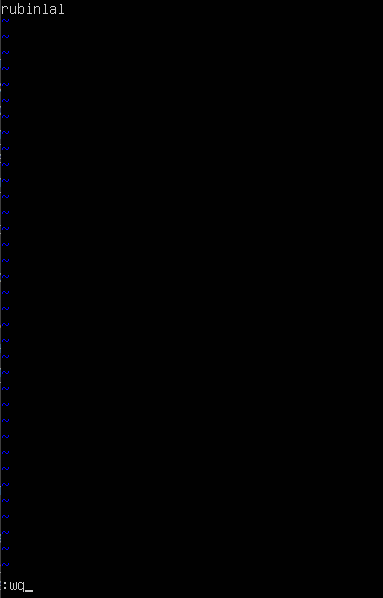  
Нажимаем `i` для режима редактирования и вписываем ник. Жмем `Esc` для выхода из режима редактирования и прописываем `:wq` для сохранения и выхода.

 

- 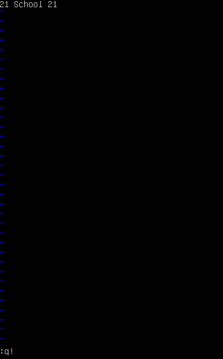  
Открываем снова этот файл `sudo vim text_vim.txt`, редактируем и выходим без сохранения `:q!`.

- 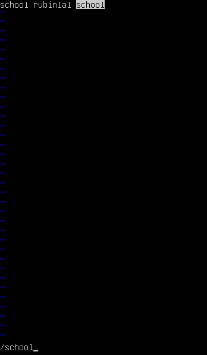  
Редактируем файл, нажимаем `/` и осуществляем поиск.

 

- 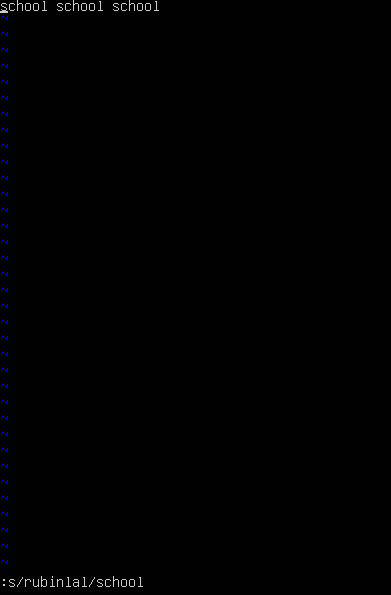  
Делаем замену слова командой `:s/слово/замена`.

 

### NANO

- 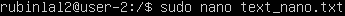  
Создаем файл и открываем с помощью nano.

 

- 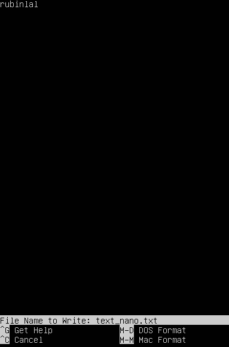  
Пишем ник, жмем `ctrl+o` и соглашаемся с выбором. Далее `ctrl+x` для выхода.

 

- 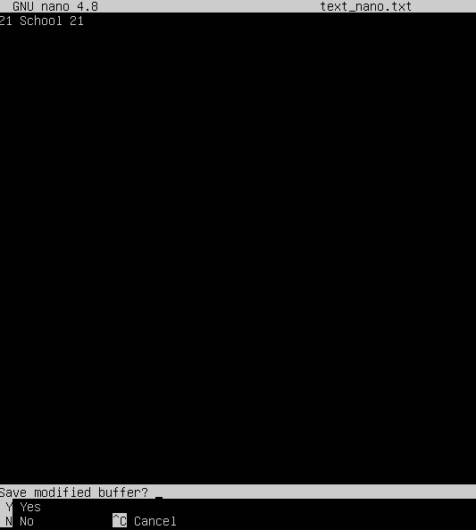  
Редактируем файл, жмем `ctrl+x`, не соглашаемся, чтобы не сохранять изменения.

 

- 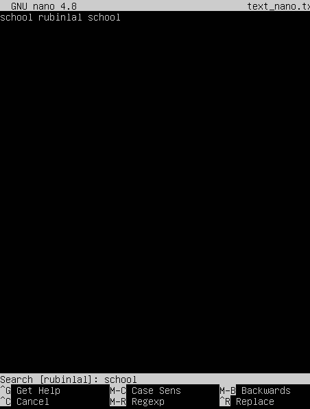  
Для поиска слова нажимаем `ctrl+w`.

 

- 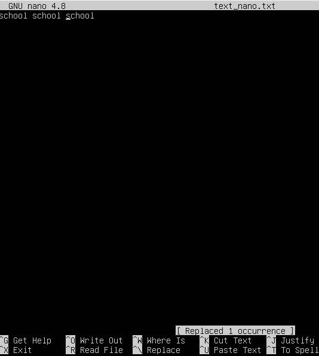  
Далее для замены слова на другое жмем `ctrl+\`. Вводим искомое слово, потом заменяемое.

 

### MCEDIT

- 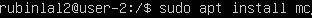  
Установили редактор mcedit вместе с пакетом mc.

 

-   
Создали файл и открыли с помощью mcedit.

 

- 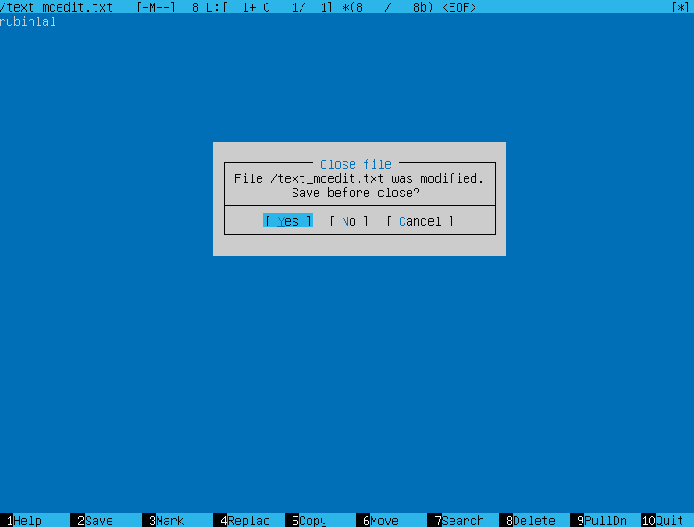
Отредактировали файл, жмем `f10` и подтверждаем выход с сохранением.

 

- 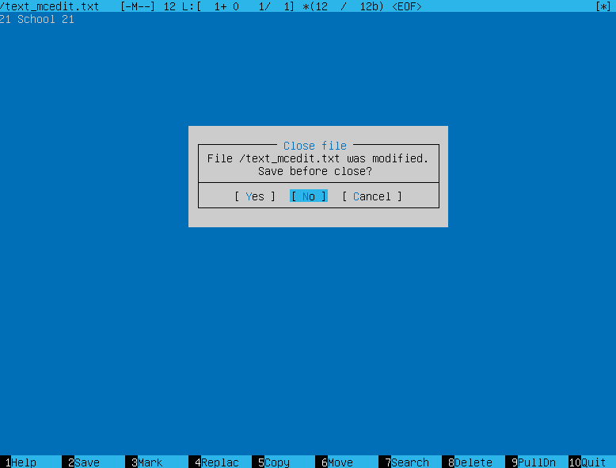  
Отредактировали файл, жмем `f10` и подтверждаем выход без сохранения.

 

- 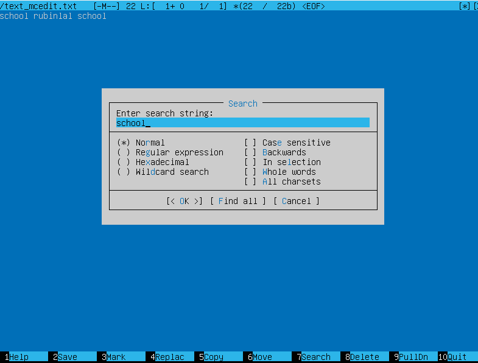  
Жмем `f7` для поиска нужного слова.

 

- 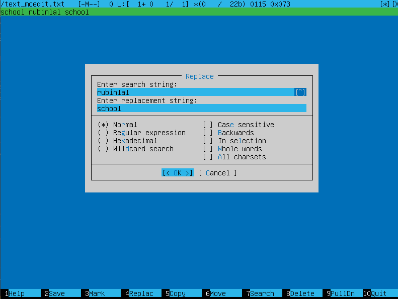  
`f4` для замены слова на другое.

## Part 8. Установка и базовая настройка сервиса SSHD

- 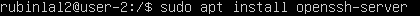  
Установили службу SSHD.

 

- 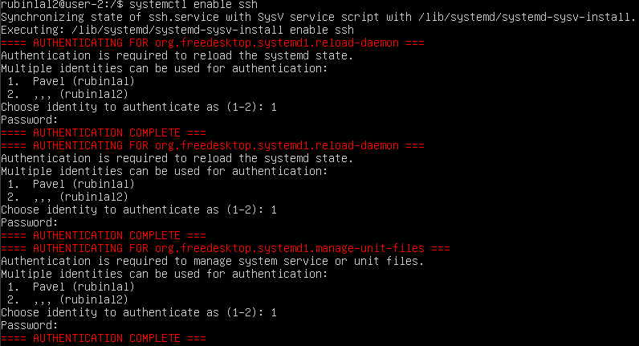 
Добавляем автостарт службы при загрузке системы командой `systemctl enable ssh`.

 

- 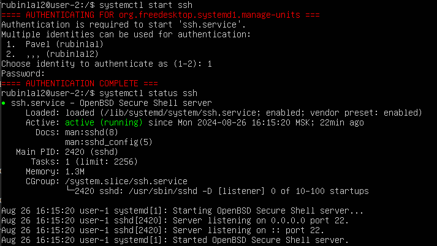  
Запускаеv службу `systemctl start ssh`. Затем проверяем статус.

 

- 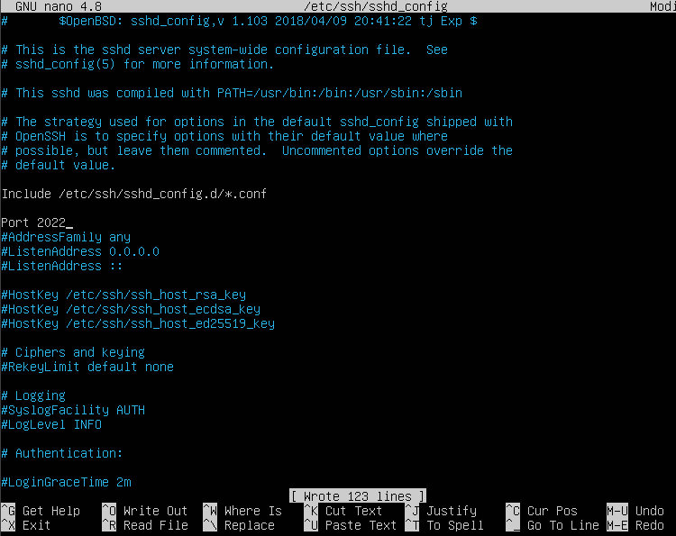 
Настраиваем порт 2022 командой `nano /etc/ssh/sshd_config`.

 

- 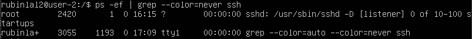 
`ps` - программа выводящая отчёт о работающих процессах, флаг `e` - выбрать все процессы, флаг `f` - вывести максимум доступных данных, например, количество потоков.

 

- 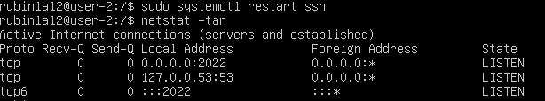  
Перезапустили службу ssh. Далее использовали команду `netstat -tan`. Объясним каждое значение выведенной таблицы.
* флаг t - показать порты протокола TCP.

* флаг a - cписок всех портов.

* флаг n - показывать ip адреса в числовом виде.

* Proto - название протокола.

* Recv-Q -количество запросов в очередях на приём на данном узле/компьютере

* Send-Q -количество запросов в очередях на отправку на данном узле/компьютере.

* Local Address - IP адрес локального компьютера и номер используемого порта.

* Foreign Address - IP адрес и порт удаленного компьютера, к которому присоединен.

* State - Статус соединения по протоколу TCP.

* 0.0.0.0 - это специальный зарезервированный IP-адрес, который обозначает «все возможные адреса»*

 

## Part 9. Установка и использование утилит top, htop

- 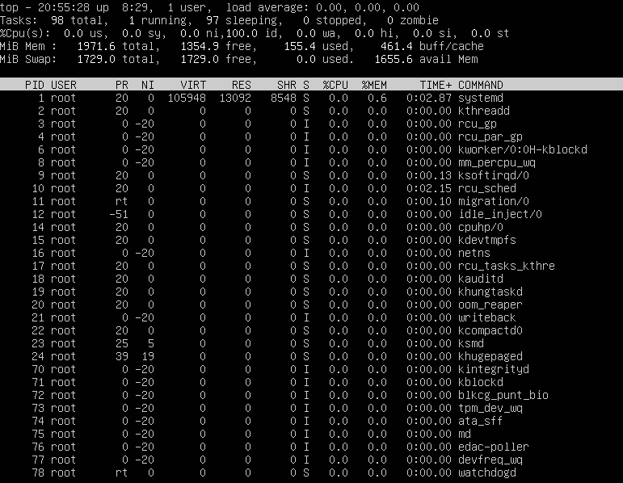  
* uptime - 8 часов, 29 минут.
* кол-во автроизированных пользователей - 1.
* общая загрузка системы - 0,00 0,00 0,00 за последние 15 минут.
* общее количество процессов - 98.
* загрузка cpu -  0.0 us, 0.0 sy, 0.0 ni,100 id, 0.0 wa, 0.0 hi, 3.8 si, 0.0 st. 
* загрузка памяти - MiB Mem & MiB Swap
* pid процесса занимающего больше всего памяти - 1.
* pid процесса, занимающего больше всего процессорного времени - 1.

 

- 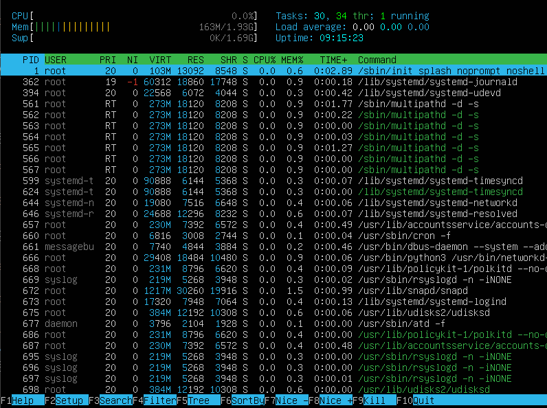  
Вывод htop отсортированный по PID (клавиша `f6`).

 

- 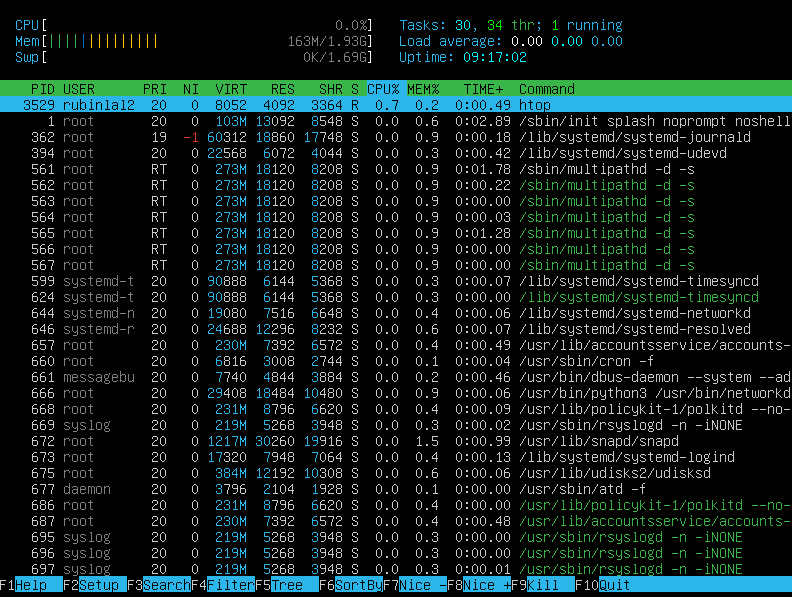
Сортировка по PERCENT_CPU.

 

- 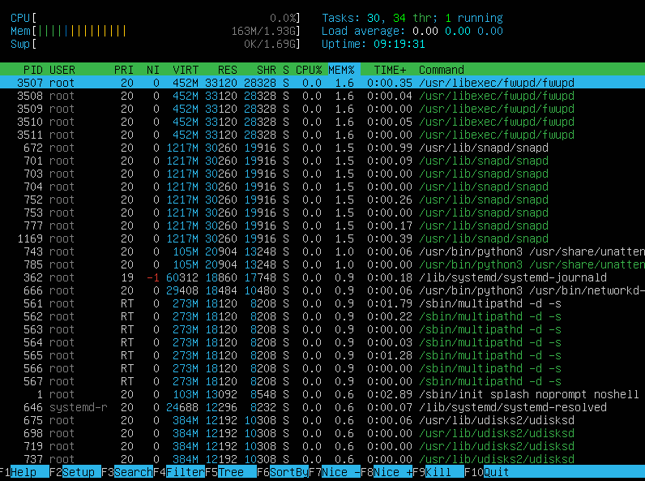
Сортировка по PERCENT_MEM.

 

- 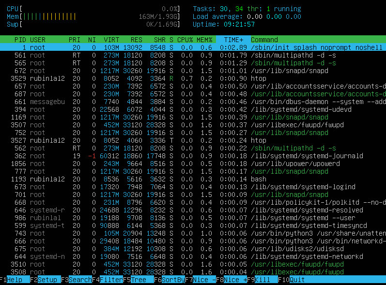  
Сортировка по TIME.

 

- 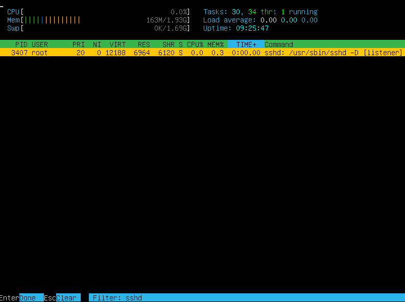  
Фильтр `f4` процесса sshd.

 

-   
С помощью поиска `f3` нашли syslog.

 

-  
Добавили вывод (`f2`) hostname, clock и uptime.

 

## Part 10. Использование утилиты fdisk

- 
Используем команду `fdisk -l`.
* Название жесткого диска: /dev/sda
* Размер жесткого диска: 11 GB
* Количество секторов: 23068672
* Размер раздела swap: 3670016 блоков. Так как размер блока по умолчанию составляет 512 байт, это составляет 3670016 * 512 = 1 879 048 192 байт или чуть меньше 2 GB.

 

## Part 11. Использование утилиты df

-   
`df` для корневого раздела (/):
- размер раздела 9440580 байт
- размер занятого пространства 5151084 байт
- размер свободного пространства 3788352 байт
- процент использования 58%

    `df -Th` для корневого раздела (/):
- размер раздела 9.1 GB
- размер занятого пространства 5 GB
- размер свободного пространства 3.7 GB
- процент использования 58%
- тип файловой системы ext4

 

## Part 12. Использование утилиты du

-   
Вывод команды du для папок /home, /var, /var/log и занимаемого места в ,байтах и человекочитаемом виде.

 

-   
Вывели размер всего содержимого в /var/log (не общее, а каждого вложенного элемента, используя *).

 

## Part 13. Установка и использование утилиты ncdu

- 
Вывели размер папки home.

 

- 
Вывели размер папки var.

 

-   
Вывели размер папки var/log.

 

## Part 14. Работа с системными журналами

-   
Последняя успешная авторизация.

 

-   
Перезагрузили службу sshd.

 

-   
Выполните команду для просмотра логов, связанных с sshd `sudo journalctl -u ssh -e`.

 

## Part 15. Использование планировщика заданий CRON

-  
Открываем файл cron и добавляем перезапуск службы каждые две минуты командой `crontab -e`.

 

-   
Проверяем журнал.

 

-   
Удаляем перезапуск службы.

 